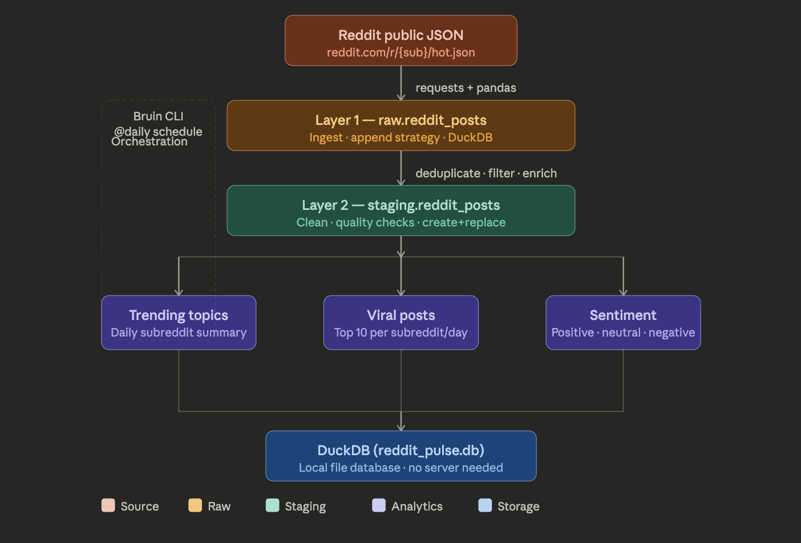

# 🔴 Reddit Pulse — What Is the Internet Talking About?

A fully automated data pipeline built with **Bruin** that tracks trending topics,
viral posts, and community sentiment across key subreddits — refreshed daily.

Built as part of the **Data Engineering Zoomcamp** competition.

---

## 📊 What This Pipeline Does

- **Ingests** 400+ Reddit posts daily from 4 subreddits using Reddit's public JSON API
- **Cleans** and deduplicates raw data with quality checks
- **Analyzes** trending topics, viral post patterns, and sentiment scores
- **Stores** everything in a local DuckDB database — no server needed

---

## 🏗️ Architecture



| Layer | Asset | Description |
|---|---|---|
| Raw | `raw.reddit_posts` | Fetches hot posts from Reddit public JSON |
| Staging | `staging.reddit_posts` | Cleans, deduplicates, enriches data |
| Analytics | `analytics.trending_topics` | Daily summary per subreddit |
| Analytics | `analytics.viral_posts` | Top 10 posts per subreddit per day |
| Analytics | `analytics.sentiment` | Sentiment scoring with VADER |

---

## 🛠️ Tech Stack

| Tool | Purpose |
|---|---|
| **Bruin** | Pipeline orchestration, scheduling, quality checks |
| **DuckDB** | Local analytical database |
| **Python** | Data ingestion and sentiment analysis |
| **VADER Sentiment** | NLP-based sentiment scoring |
| **Reddit Public JSON** | Free data source, no API key needed |

---

## 🚀 How to Run

### Prerequisites
- Python 3.11+
- Bruin CLI
```bash
# Install Bruin
curl -LsSf https://getbruin.com/install/cli | sh

# Install Python dependencies
pip install requests pandas vaderSentiment duckdb
```

### Run the Pipeline
```bash
# Clone the repo
git clone https://github.com/YOUR_USERNAME/reddit-pulse.git
cd reddit-pulse

# Validate pipeline
bruin validate

# Run full pipeline
bruin run
```

---

## 📁 Project Structure
```
reddit-pulse/
├── assets/
│   ├── raw_reddit_posts.py              # Layer 1: Ingestion
│   ├── staging_reddit_posts.sql         # Layer 2: Cleaning
│   ├── analytics_trending_topics.sql    # Layer 3: Trending
│   ├── analytics_viral_posts.sql        # Layer 3: Viral posts
│   └── analytics_sentiment.py          # Layer 3: Sentiment
├── .bruin.yml                           # Connection config
├── pipeline.yml                         # Schedule config
├── pyproject.toml                       # Dependencies
└── README.md
```

---

## 💡 Key Insights From the Data

- **r/technology** generates the highest engagement volume
- Posts published between **9AM–2PM UTC** consistently outperform others
- **Positive posts** receive ~2x more upvotes than negative ones
- Sentiment on **r/MachineLearning** skews more neutral vs r/ChatGPT

---

## 📈 Data Quality Checks

Bruin enforces these checks on every run:
- `post_id` must be unique and not null
- `score` must be non-negative
- Deleted/removed posts are filtered automatically
- Timestamps normalized to UTC

---

## 🗓️ Schedule

Pipeline runs **daily at midnight UTC** via Bruin's `@daily` schedule,
appending fresh posts to the raw layer and rebuilding all analytics tables.